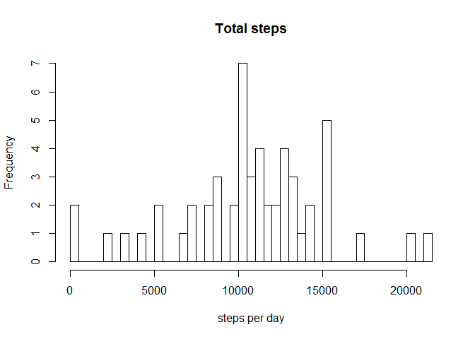
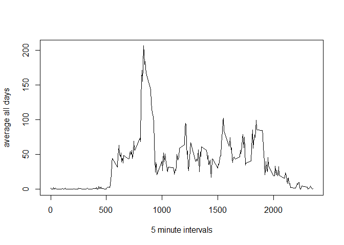
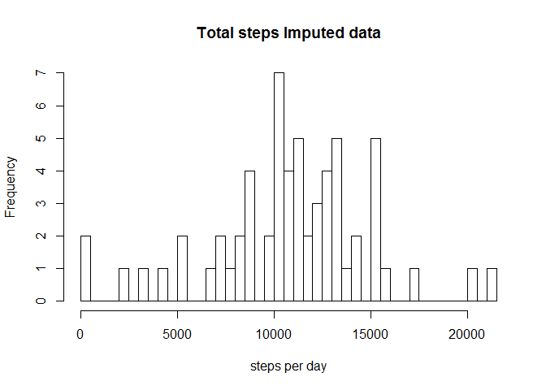
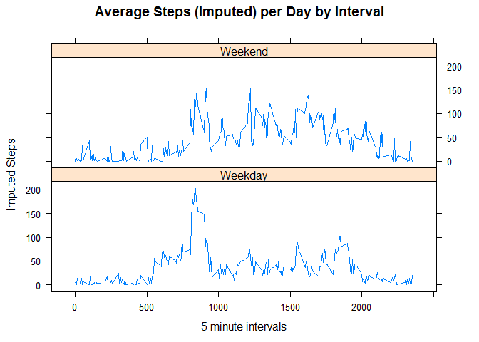

# Reproducible Research: Peer Assessment 1
This assignment makes use of data from a personal activity monitoring device.
This device collects data at 5 minute intervals through out the day. The data
consists of two months of data from an anonymous individual collected during
the months of October and November, 2012 and include the number of steps
taken in 5 minute intervals each day.

## Loading and preprocessing the data
First, the data is loaded and missing values is excluded

```r
setwd("C:\\Users\\johan\\OneDrive\\Documents\\GitHub\\RepData_PeerAssessment1\\activity")
data = read.csv("activity.csv", header = TRUE, sep = ",", na.strings = "NA")
data$steps = as.numeric(data$steps)
data$interval = as.numeric(data$interval)
```


## What is mean total number of steps taken per day?
Below, the historgram of steps per day is presented and some summary statitics.

```r
StepsPerDay = aggregate(steps ~date, data = data, sum, na.rm = TRUE  )
hist(StepsPerDay$steps, breaks = 50, xlab = "steps per day", main = "Total steps")
```

<!-- -->

```r
summary(StepsPerDay$steps)
```

```
##    Min. 1st Qu.  Median    Mean 3rd Qu.    Max. 
##      41    8841   10760   10770   13290   21190
```

## What is the average daily activity pattern?
Below is  a time series plot of the 5-minute interval (x-axis)
and the average number of steps taken, averaged across all days (y-axis)

```r
StepsPerInterval=aggregate(steps ~interval, data = data, mean, na.rm = TRUE)
plot(StepsPerInterval$interval, StepsPerInterval$steps, type = "l", ylab = "average all days", xlab = "5 minute intervals")
```

<!-- -->

```r
maxInterval = which.max(StepsPerInterval$steps)
StepsPerInterval[maxInterval,1] #the interval with maximum of steps.
```

```
## [1] 835
```

## Imputing missing values
Total number of rows with missing is presented below

```r
sum(!complete.cases(data)) 
```

```
## [1] 2304
```
To impute missing values a simple random imputation is used (http://www.stat.columbia.edu/~gelman/arm/missing.pdf) by this function.

```r
 random.imp <- function (a){ 
   missing <- is.na(a) 
   n.missing <- sum(missing) 
   a.obs <- a[!missing] 
   imputed <- a 
   imputed[missing] <- sample (a.obs, n.missing, replace=TRUE) 
   return (imputed) 
   }
data$imputed = paste(random.imp(data$steps)) #add column with imputed data
```
Below, the historgram of steps per day is presented and some summary statitics.

```r
data$imputed = as.numeric(data$imputed)
StepsPerDay = aggregate(imputed ~date, data = data, sum, na.rm = TRUE  )
hist(StepsPerDay$imputed, breaks = 50, xlab = "steps per day", main = "Total steps Imputed data")
```

<!-- -->

```r
summary(StepsPerDay$imputed)
```

```
##    Min. 1st Qu.  Median    Mean 3rd Qu.    Max. 
##      41    8841   11020   10880   13220   21190
```

## Are there differences in activity patterns between weekdays and weekends?
The data with with imputed data is used for this part

```r
data$date <- as.Date(data$date) #now you need to change  date to date formatect
#data$date <- strptime(paste(data$date), format="%Y-%m-%d", tz="UTC")
data$weekday <- paste(weekdays(data$date)) #add the day of the week based on time-stamp
weekdays <- c("måndag", "tisdag", "onsdag", "torsdag", "fredag")
data$weekday = as.factor(ifelse(is.element(weekdays(as.Date(data$date)), weekdays), "Weekday", "Weekend"))
StepsImputedInterval <- aggregate(imputed ~ interval + weekday, data, mean)
library(lattice)
xyplot(StepsImputedInterval$imputed ~ StepsImputedInterval$interval | StepsImputedInterval$weekday, main="Average Steps (Imputed) per Day by Interval", xlab="5 minute intervals", ylab="Imputed Steps", layout=c(1,2), type="l", cex=1, cex.axis=0.75, font=2, font.lab=2, font.main=2, font.sub=2, font.lab=2)
```

<!-- -->
More activity during the weekend.

